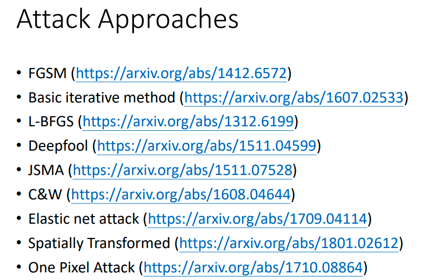
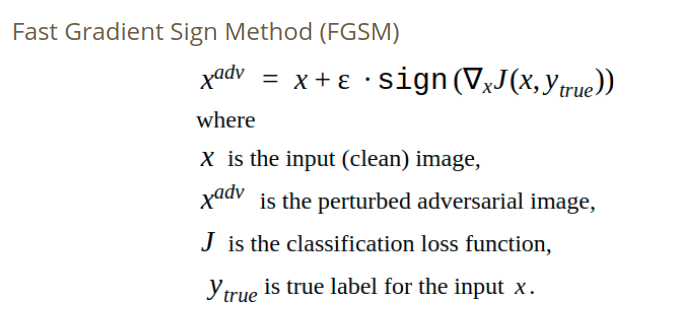
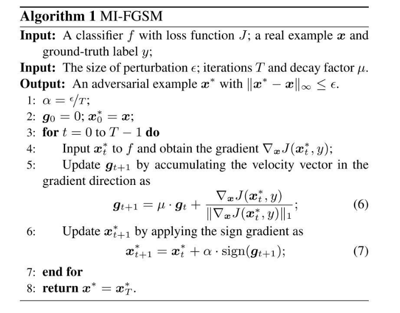
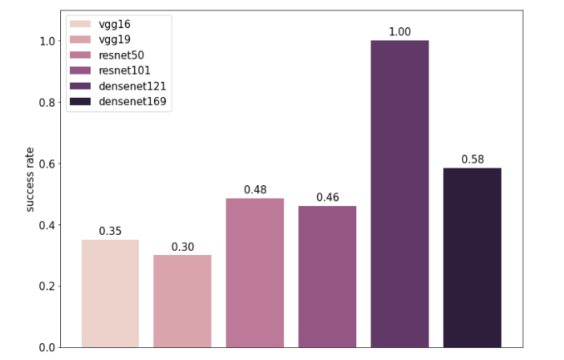

# Adversarial Attack
## Task Description
* Adversarial attack是一種造成深度學習模型判斷錯誤的攻擊手法，而除了實作不同的adversarial attack方法外，也需要嘗試不同的proxy model來black box模型進行攻擊，希望達到最高的攻擊成功率並極小化L-inf
* black box模型可能種類：
  * VGG-16
  * VGG-19
  * ResNet-50
  * ResNet-101
  * DenseNet-121
  * DenseNet-169
* Dataset:
  * 200張224 x 224 RGB影像
  * categories.csv: 總共1000 categories
  * labels.csv: 每張影像的info
 ## Download Dataset
 [Download link](https://drive.google.com/open?id=14CqX3OfY9aUbhGp4OpdSHLvq2321fUB7)
 ## Implementation
   
 ### Approach
 我所嘗試的兩種adversarial attack方法為FGSM和MI-FGSM，其中FGSM只會執行一個iteration，速度較快但是效果一般，而MI-FGSM引入momentum進行計算，並利用多個iteration進行迭代，得到的結果較佳，而我所選用的epsilon為0.017
   
   
 ### Black Box Model
 經過測試後發現使用DenseNet-121的攻擊成功率最高，因此可以推測出black box model為DenseNet-121
   
 ### Reference:
投影片部份取自李宏毅教授的機器學習課程 (
[Adversarial Attack](http://speech.ee.ntu.edu.tw/~tlkagk/courses/ML_2019/Lecture/Attack%20(v8).pdf)
[作業說明投影片](https://docs.google.com/presentation/d/1aQNgb0dA6aAplW3U8l1wxc6LDjo7gpEOyEL5zlLJwcg/edit#slide=id.p9) )
