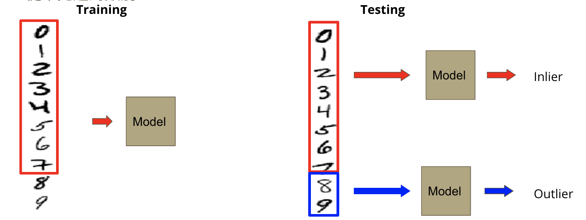
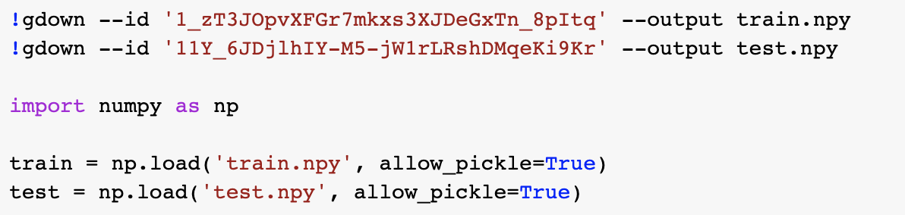
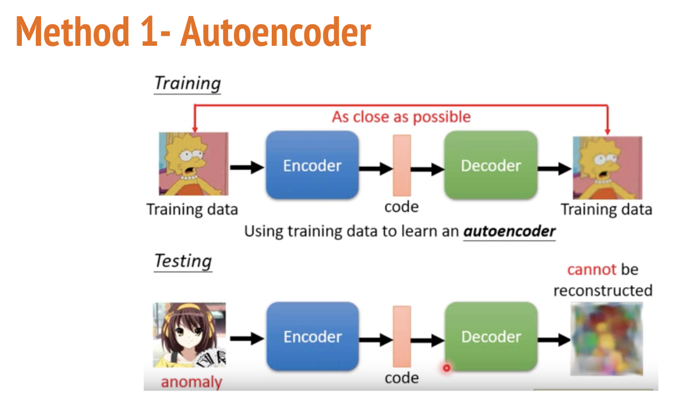
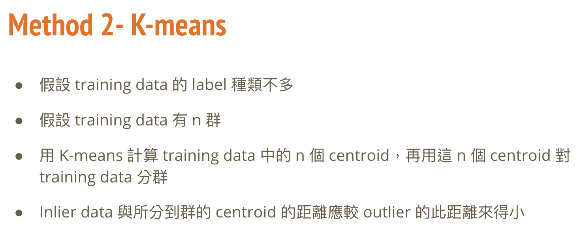
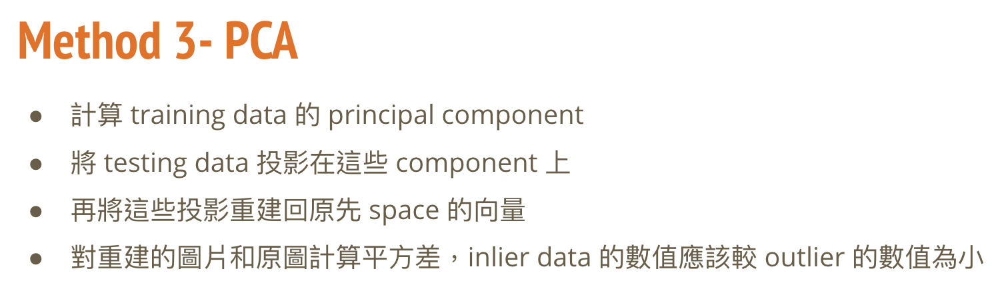
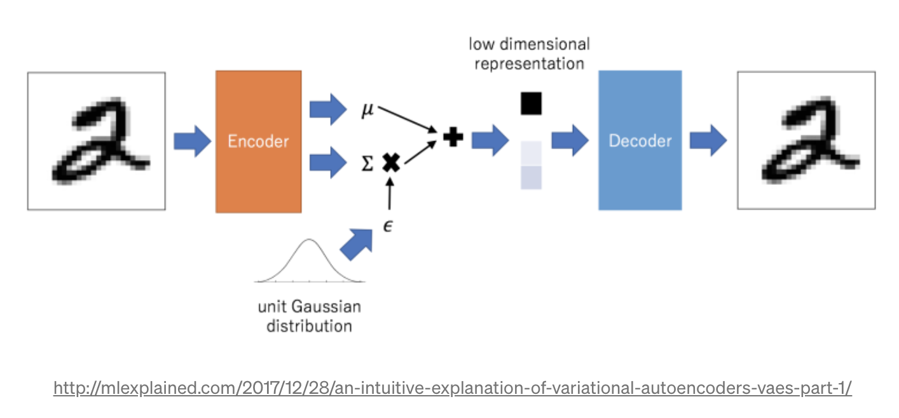

# Anomaly Detection
## Task Description
* Semi-supervised anomaly detection: 在只給定乾淨的（無anomaly）training data的情況下，分辨 testing data 中哪些 data 是來自 training 或是從未見過的類別
* Dataset:
  * Training: 某個 image dataset 的 training data (大小32*32*3) 中的屬於某些 label的data（40000 筆）
  * Testing: 此 dataset 的所有 testing data（10000 筆）
  
## Download Dataset
  
## Implementation
  
  
  
### Autoencoder 架構
* FCN (fully connected neural network)
* CNN (convolutional neural network)
* VAE (variational autoencoder)  
  

---
### Reference:
投影片部份取自李宏毅教授的機器學習課程 (
[Anomaly Detection](http://speech.ee.ntu.edu.tw/~tlkagk/courses/ML_2019/Lecture/Detection%20(v9).pdf)
[作業說明投影片](https://docs.google.com/presentation/d/1kvYOBycYRs9P-nWrlZNnwmdnnAO6w69jKjCxmTRlNqU/edit#slide=id.p2)
[Kaggle](https://www.kaggle.com/c/ml2020spring-hw10))
