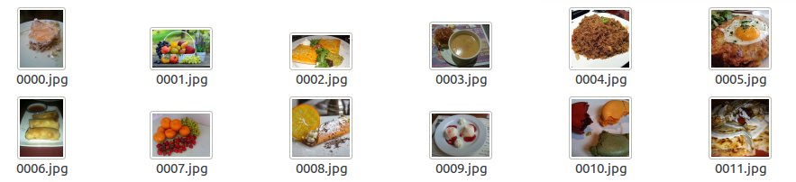
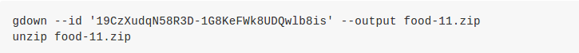
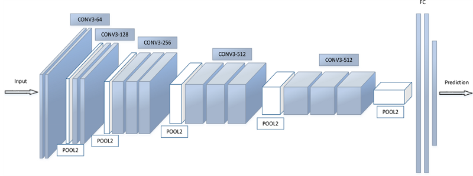
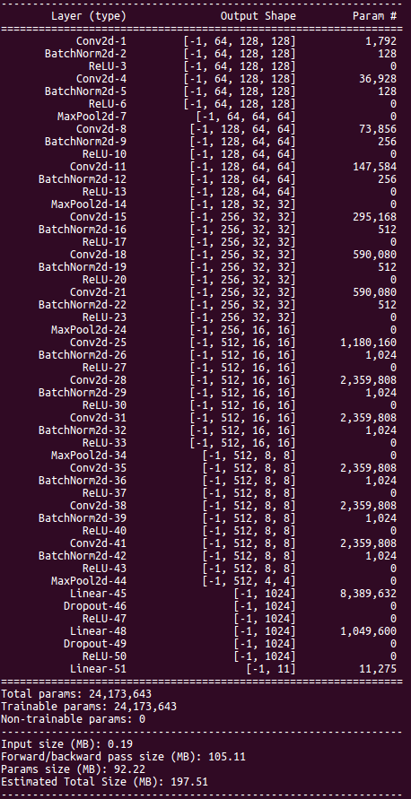

# Convolutional Neural Network
## Task Description: Image Classification
* 此次資料集為網路上蒐集到的食物照片，共有11類
( Bread, Dairy product, Dessert, Egg, Fried food, Meat, Noodles/Pasta, Rice, Seafood, Soup, and Vegetable/Fruit )
  * Training set: 9866張
  * Validation set: 3430張
  * Testing set: 3347張
* 利用資料集來訓練出一個CNN model，以此預測出每張圖片的食物種類
  
## Download Dataset
  
## Implementation
### Model Selection
在CNN模型的選擇上，我實作的模型是參考自VGG16，如下圖所示:
  
 
其中包括13層Convolution Layer，5層MaxPooling，3層Fully-Connected Layer，而會選擇VGG16的原因是深度較淺的CNN模型經過測試後表現較差，但是也並非深度越深效果越好，深度越深的模型在training時花費的時間越多，也可能會因為訓練資料不足而導致overfitting的情況更加嚴重，而詳細的模型架構和參數量如下圖(torchsummary)所示:
 
 
  
* Conv2d(): filter size均為3x3，stride均為1
* BatchNorm2d(): 加在每一層Conv Layer裡，能夠達到加速訓練速度的效果
* ReLU(): CNN常使用的activation function，加在每一層Conv Layer和FC Layer裡，能夠克服梯度消失問題且節省計算量
* MaxPool2d(): pooling size均為2x2，效果比使用average pooling來得好
* Dropout(): 加在前兩層FC Layer後，可以達到regularization的效果以避免overfitting

### Optimizer Selection
在Optimizer的選擇上，我選擇使用Adam + SGDM，其中選擇Adam的優點在於收斂的速度較快，可以節省許多training花費的時間，但缺點是收斂的結果較差，因此我選擇在前200個epoch使用Adam，而後50個epoch使用收斂結果較好的SGDM，兩者結合後在testing data上得到的準確率會比單獨使用Adam來的高

### Data Augmentation
在訓練模型的每個epoch前，對圖片做一些隨機的變動，來增加訓練資料的多樣性，以此減少overfitting的情形，此種技巧稱為data augmentation，主要可以解決資料量不足的情況並且提昇訓練的準確率，而我所使用的種類包括:
* RandomHorizontalFlip(): 隨機水平翻轉
* RandomRotation(): 隨機旋轉圖片
* ColorJitter(): 隨機調整圖片亮度、對比度、飽和度
* RandomPerspective(): 隨機對圖片進行透視變換
* RandomCrop(): 隨機裁切圖片
* RandomAffine(): 保持圖片中心不變的情況下，隨機對圖片進行仿射變換
* ToTensor(): 將數值normalize到0~1之間

### CNN v.s. DNN
經過測試後，在維持兩者模型參數量相近的情況下，DNN在testing set上的準確率僅有20 ~ 30%，反之，CNN則可以高達80 ~ 90%，因此發現DNN在圖片辨識上的表現不太優秀，即使使用較龐大的模型也無法改善，但是對於比較簡單的問題如MNIST等，DNN仍能夠有不錯的準確率，而CNN與DNN最大的差別在於，CNN的Conv Layer會抽取出圖片的特徵，其中前幾層負責較簡單的特徵，如線條或輪廓等，而越後面則負責越複雜的特徵，同時Pooling Layer能夠讓特徵在圖片中的不同區域都得到重視，以此提高模型對於圖片的辨識率

---
### Reference:
投影片部份取自李宏毅教授的機器學習課程 (
[CNN](http://speech.ee.ntu.edu.tw/~tlkagk/courses/ML_2017/Lecture/CNN.pdf)
[作業說明投影片](https://docs.google.com/presentation/d/1_6TJrFs3JGBsJpdRGLK1Fy_EiJlNvLm_lTZ9sjLsaKE/edit#slide=id.p4)
[kaggle連結](https://reurl.cc/ZO7XpM) )
