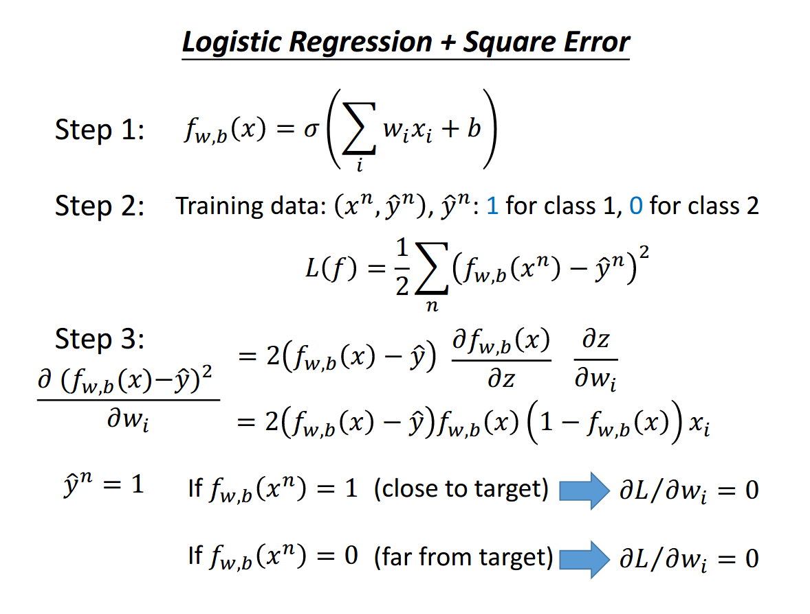
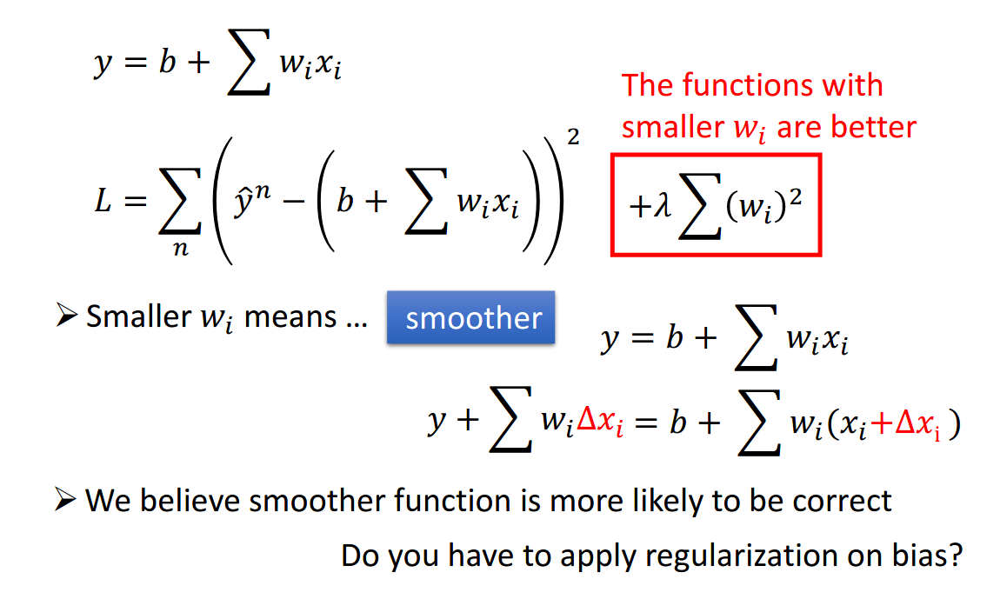
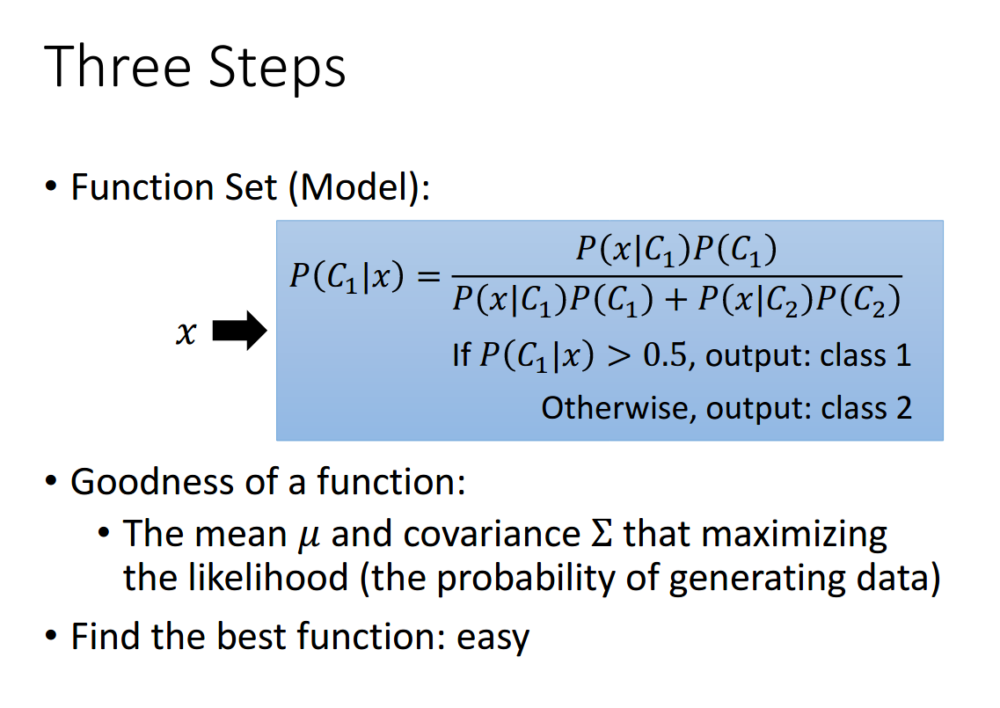
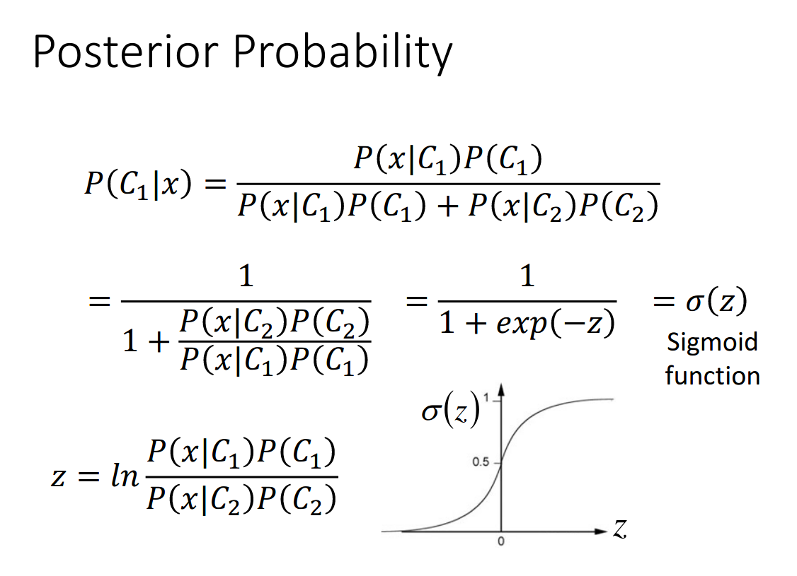

# Classification
## Task Description: Binary Classification
* 實作一個線性二元分類器，來根據人們的個人資料，判斷其年收入是否高於 50,000 美元
* X_train, Y_train, X_test
  * 非連續性資料: 例如教育程度、婚姻狀態...
  * 連續性資料: 例如年齡、資本損失...
  * X_train, X_test : 每一列包含一個510維的資料作為一個樣本
  * Y_train: label = 0 代表  “<= 50K” 、 label = 1 代表  “ >50K ”
## Implementation
### Logistic Regression
### 實作步驟:  
  
### Feature Engineering:  
* 加入feature normalization後準確率有很大的提升，應用此技巧可以改善資料範圍不同的問題，以這次問題的training data為例，
有許多資料的值為0或1，但像age這類連續性資料，範圍有可能是0-100，但並不代表age對classification佔有很大的比重
* 在510維的feature之後加上二次項和三次項，總共1530維，再進行training
### Optimizer Selection:  
Optimizer | 特點
----------|------
SGD       | 對所有的參數更新使用相同的learning rate   容易收斂到局部最小值，並且容易被困在鞍點   需要較長時間收斂至最小值 
SGDM      | momentum能夠在相關方向加速SGD，從而加快收斂   收斂的時間比起Adagrad和Adam來得長，但通常結果較為可靠
Adagrad   | 會自動調整learning rate   適合處理稀疏梯度   分母梯度的累加會越來越大，導致梯度最終趨近0，使得training結束
Adam      | 結合SGDM和Adagrad的優點   training的速度快   目前普遍最常使用的optimizer

Adam的強項在於速度快，但收斂效果則常常不是最好，由於這次的task很簡單，因此任何算法都可以很快收斂，所以使用Adam的效果就不是很好，同時考慮到效能和收斂結果兩者因素，最終選擇Adagrad作為optimizer

### Regularization:  
  
在加入regularization後，經過測試發現會比沒加入regularization來得更差，原因是regularization的用意是在防止分類器太貼合training data，也就是說分類的切面太崎嶇，但這次的線性分類器不會有這個問題，所以基本上不需要做regularization

---
### Porbabilistic Generative Model
### 實作步驟:  
 
 

---
### Comparison
比較generative model和logistic regression在development set和testing data上的準確率後，發現都是logistic regression的準確率較佳，generative model與logistic regression不同的地方在於generative model會對資料之間的機率分布做假設，而當資料少的時候，或許generative model能夠有比較好的結果，但當training data夠多的時候，generative model的這些假設就不見得是正確的，因此造成logistic regression有較佳的準確率

---
### Reference:
投影片部份取自李宏毅教授的機器學習課程 (
[Logistic Regression](http://speech.ee.ntu.edu.tw/~tlkagk/courses/ML_2016/Lecture/Logistic%20Regression%20(v3).pdf)
[Classification](http://speech.ee.ntu.edu.tw/~tlkagk/courses/ML_2016/Lecture/Classification%20(v3).pdf)
[作業說明投影片](https://docs.google.com/presentation/d/1dQVeHfIfUUWxMSg58frKBBeg2OD4N7SD0YP3LYMM7AA/edit#slide=id.g7e958d1737_0_44)
[kaggle連結](https://www.kaggle.com/c/ml2020spring-hw2) )
