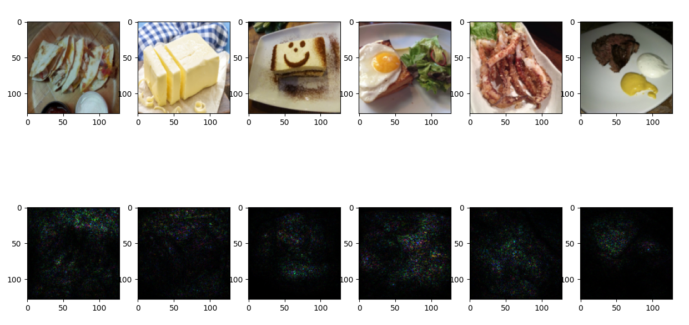
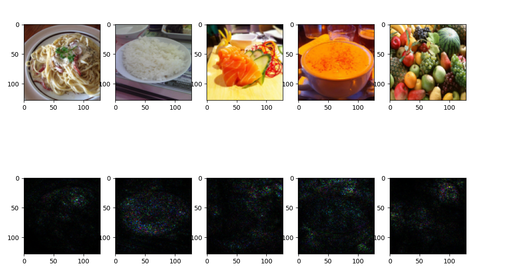
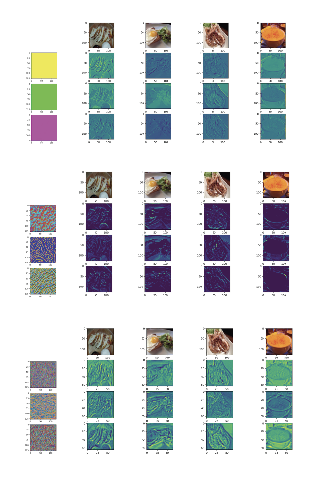
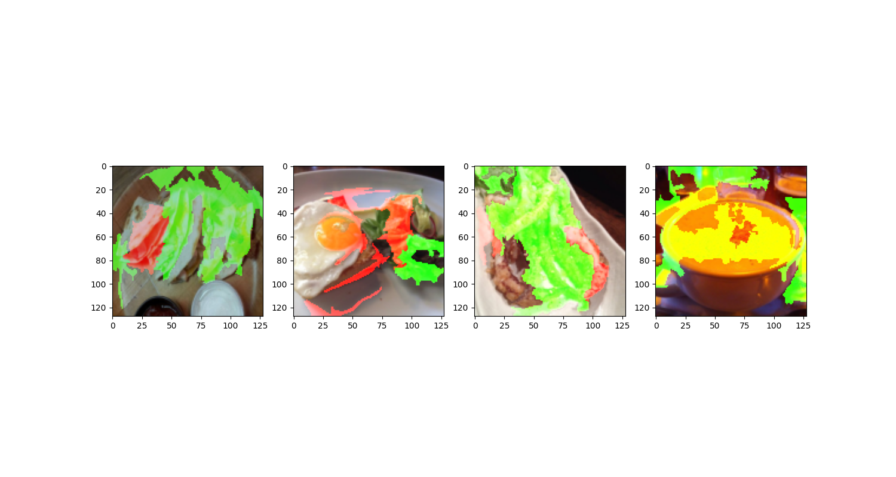
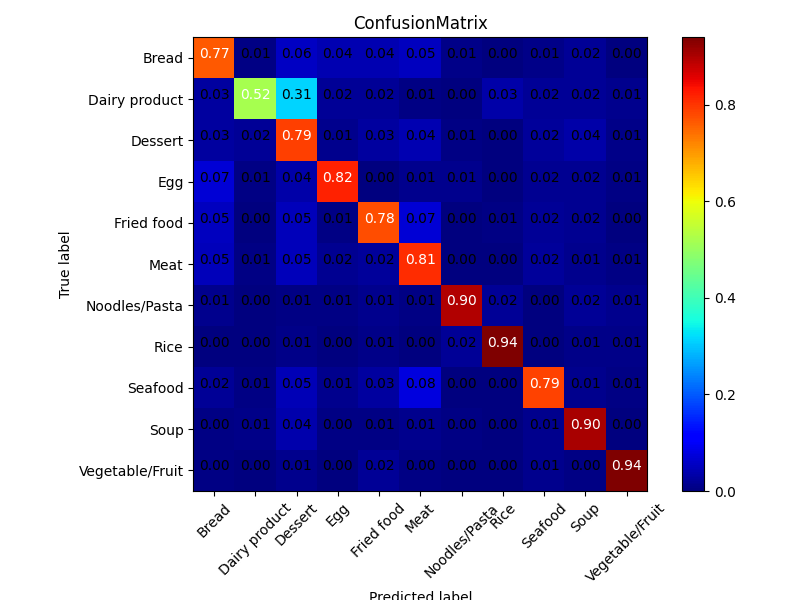

# Explainable AI
## Task Description
* 透過更加透明化的資訊來了解模型判斷的依據和背後原因，以此幫助建模者除錯和改善模型
  * Saliency Map
  * Filter Visualization
  * Lime
  * Confusion Matrix
* 利用在CNN的task中使用的dataset和訓練完的模型並實作各種explainable AI的方法
## Download Dataset
  
## Implementation
### Saliency Map
  
  
### Filter Visualization
  
### Lime
  
### Confusion Matrix
  

---
### Reference:
投影片部份取自李宏毅教授的機器學習課程 (
[Explainable AI](http://speech.ee.ntu.edu.tw/~tlkagk/courses/ML_2019/Lecture/XAI%20(v7).pdf)
[作業說明投影片](https://docs.google.com/presentation/d/1VClvgyilAvohextY0tM3gD7YemXGSUrzLV0E8RjDnMU/edit) )
