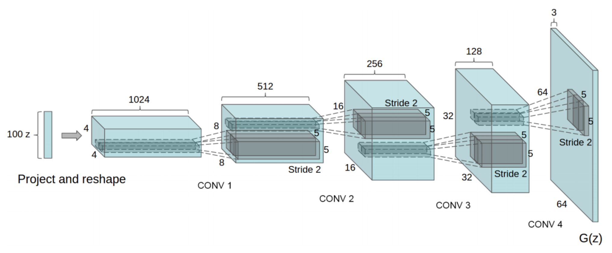
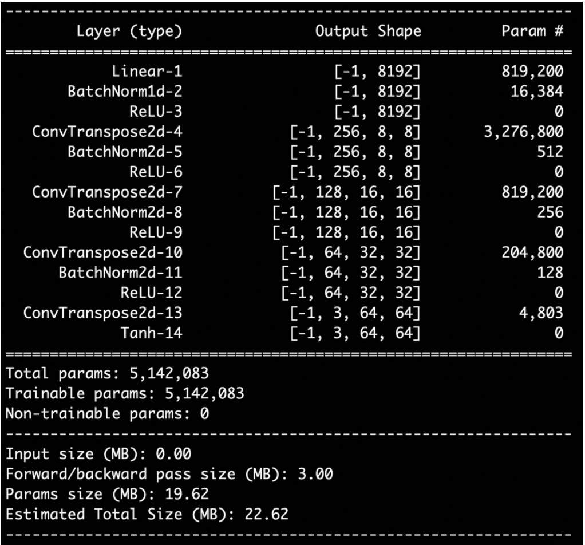
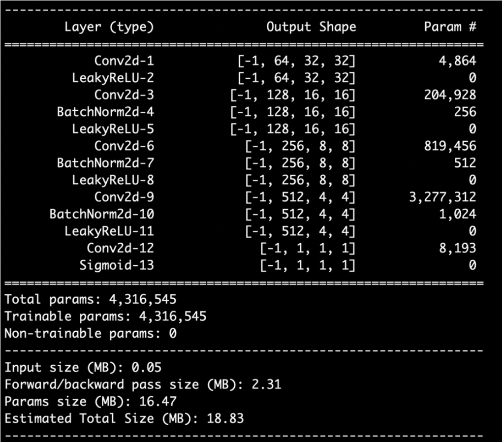
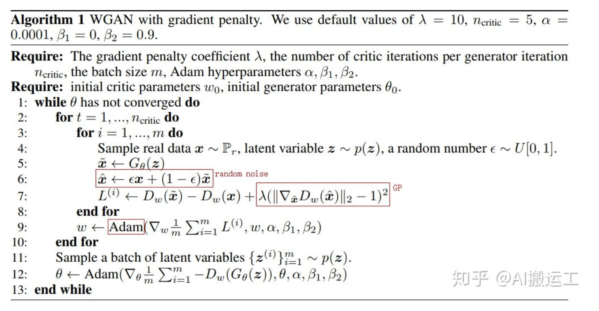

# GAN
## Task Description
* 透過 GAN 進行圖像生成
* 使用 DCGAN 作為 baseline mode，圖示為 DCGAN 架構示意圖
  
## Download Dataset

## Implementation
* GAN
  * Generator:  
    
  * Discriminator:  
    
* WGAN-GP
  
---
### Reference:
投影片部份取自李宏毅教授的機器學習課程 (
[GAN](http://speech.ee.ntu.edu.tw/~tlkagk/courses/MLDS_2018/Lecture/GAN%20(v2).pdf)
[作業說明投影片](https://docs.google.com/presentation/d/1uiyajjlvamCqbXscMbcZC5mqqC138jDPEapAjDuXHTM/edit#slide=id.g810edf731e_0_20) )
