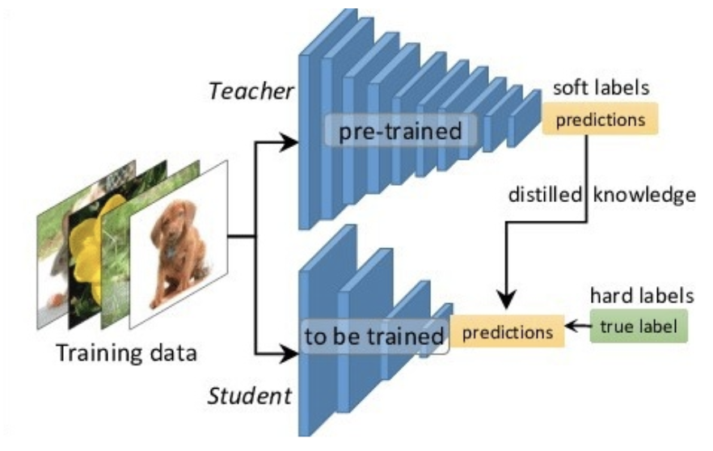
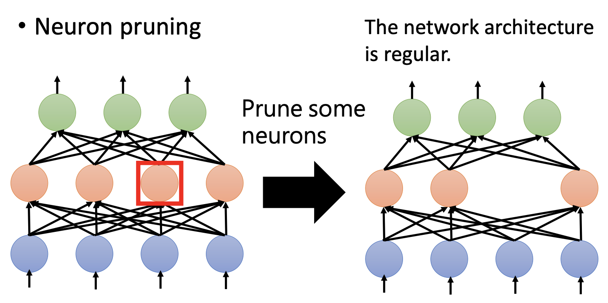
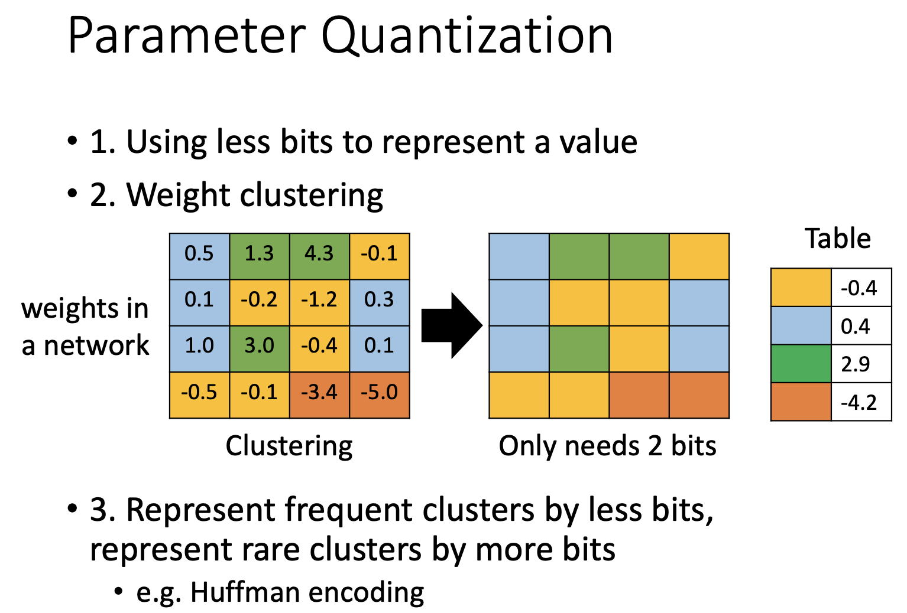
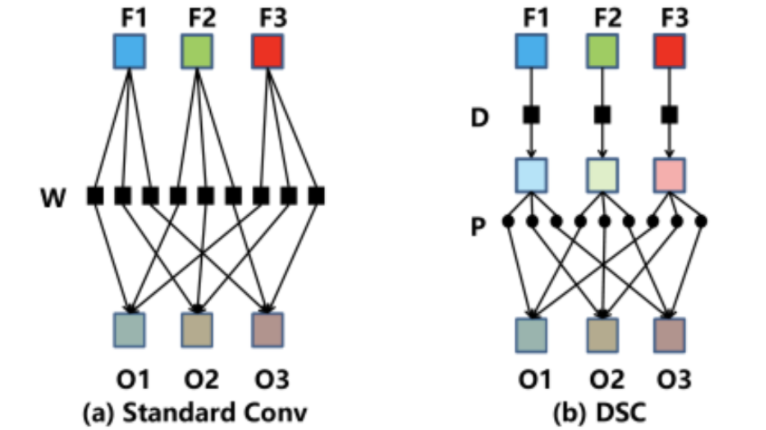

# Network Compression
## Task Description
* 訓練好的模型我們可以希望可以佈到一些移動設備上，像是手機、手錶、空拍機之類的設備。但這類的設備本身並沒有足夠的計算資源，所以希望用一個小model也可以模擬出大model的行為/正確率
* Network / Model Compression 方法：
  * Knowledge Distillation: 讓小 model 在學習任務的時候，藉由觀察大 model 的行為來讓自己學得更好
  * Network Pruning: 將已經學習好的大 model 做剪枝，讓整體 model 變小
  * Weight Quantization: 用更好的方式來表現 model 中的參數，以此降低運算量/消耗容量
  * Design Architecture: 將原始的 layer 用更小的參數來表現 (例如 Convolution ￫ Depthwise & Pointwise Convolution) 
## Download Dataset

## Implementation
### Knowledge Distillation
在 train 小 model 的時候，加入大 model 的一些資訊(例如預測的機率分布)來幫助小model學習  
  
### Network Pruning
將已經 train 好的 model 做剪枝使其變小
  
### Weight Quantization
  
### Design Architecture
Depthwise & Pointwise Convolution Layer (MobileNet 提出)
* 原始的 Conv 你可以想像成它就是一個 Dense/Linear Layer，但是每一條線/每一個 weight 都是一個 filter，而原本的乘法會變成卷積運算 (input*weight -> input * filter)
* 而 Depthwise 是讓每一個 Channel 都先過一個各自的 filter，再對每個 pixel 過shared-weight的Dense/Linear (Pointwise其實就是1x1 conv)  
  

---
### Reference:
投影片部份取自李宏毅教授的機器學習課程 (
[Network Compression](http://speech.ee.ntu.edu.tw/~tlkagk/courses/ML_2019/Lecture/Small%20(v6).pdf)
[作業說明投影片](https://docs.google.com/presentation/d/1n5gc0uk3ysoOzfH2kd56DJwj-BE6le_CXiBboK9g8Hk/edit#slide=id.g7bf2fa9c47_0_0)
[Kaggle](https://www.kaggle.com/c/ml2020spring-hw7))
