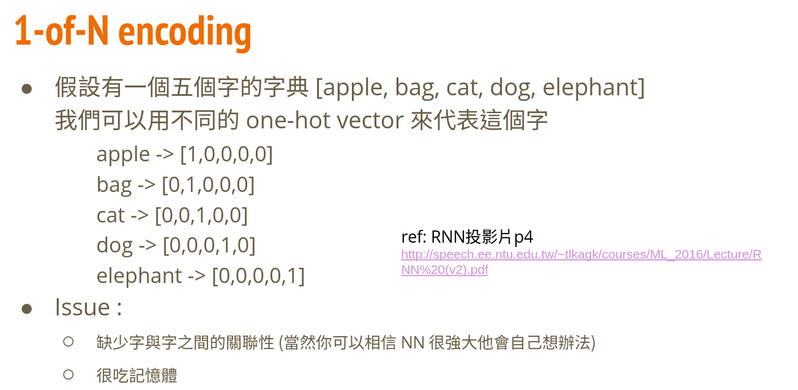
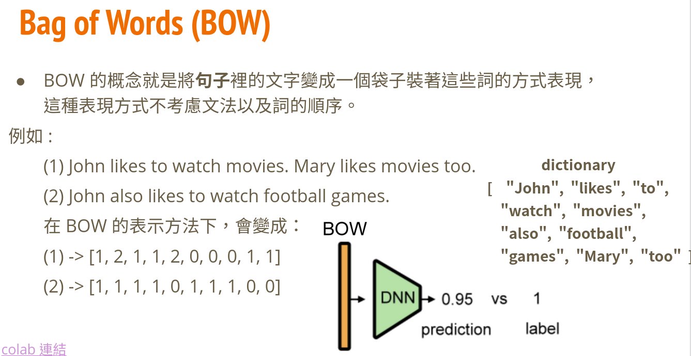
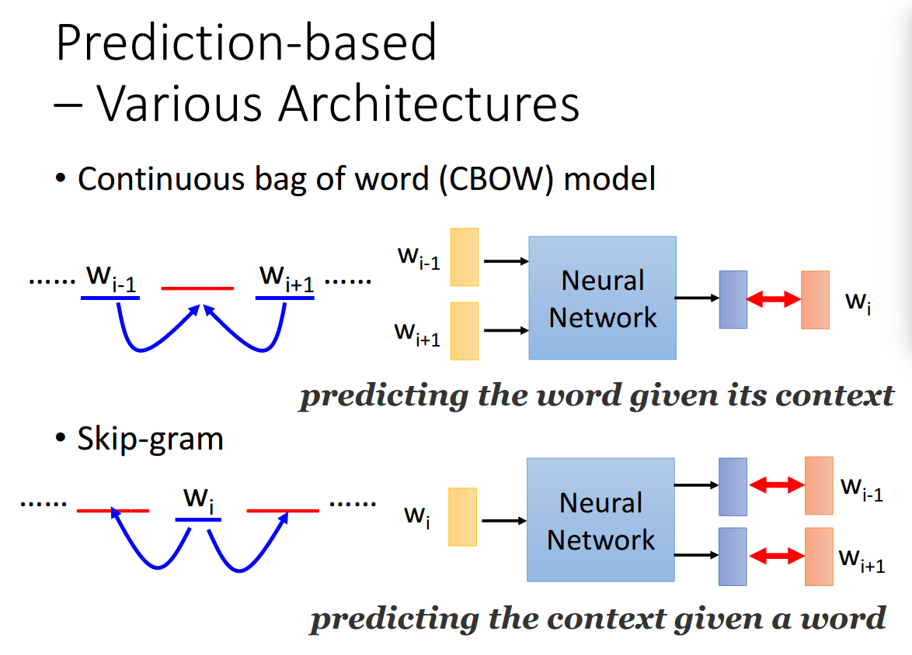
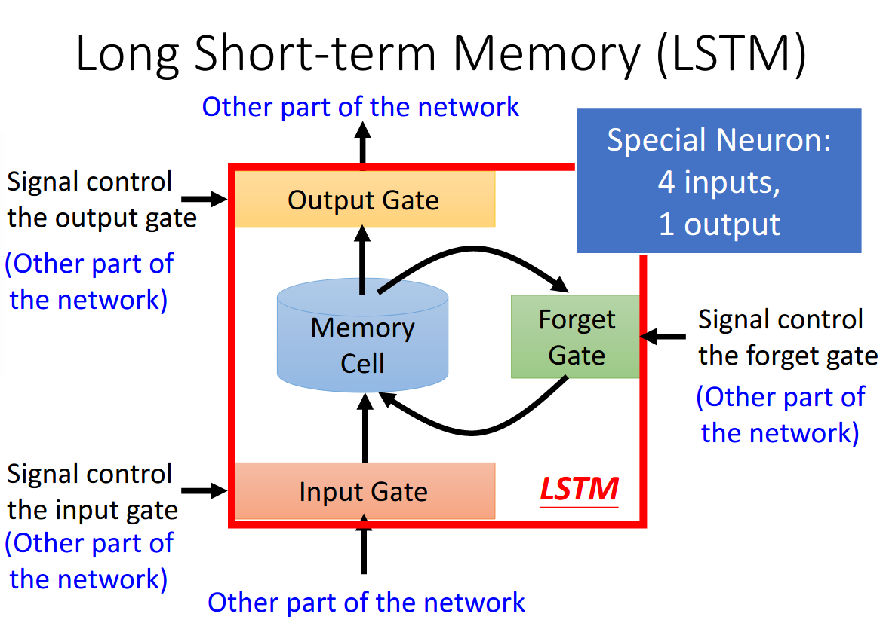

# Recurrent Neural Network
## Task Description: Text Sentiment Classification
* 本次task的data為twitter上收集到的推文，每則推文都會被標注為正面或負面，如:
   
 1：正面  
  
0：負面  
* dataset分為training和testing，其中training dataset又分為labeled training data和unlabeled training data
  * labeled training data    : 20萬 （句子配上0 or1，+++$+++ 只是分隔符號）
  * unlabeled training data  : 120萬 （只有句子，用來做semi-supervised learning)
  * testing data             : 20萬
* 希望利用training dataset訓練一個RNN model，來預測每個句子所帶有的情緒
## Download Dataset
  
## Implementation
### Word Embedding
Word embedding是一種將單字轉換為向量的方法，常見的word embedding方法有三類，大致上分為1-of-N Encoding，Bag-of-Words，和Prediction-Based Embedding:  
  
 
  
 
  
 
由於1-of-N encoding和BOW這兩種方法都有明顯的缺點，因此我最終選擇prediction-based embedding中的skip-gram，其中skip-gram和CBOW都可以直接使用gensim這個套件來完成，不需要親自手刻
### Preprocessing
* pad sequence: 將每個句子變成一樣的長度，經過測試後發現當長度為35時有最佳的結果，如果句子長度過短的話，可能會有沒將重要資訊讀入的情況
* remove stopword: 移除資料中出現特別頻繁的詞，如"a", "the", "is", "are"，但是經過測試後發現反而會使準確率下降，因此最後沒有使用
* remove number & symbol: 移除資料中出現的數字和符號，經過測試後也同樣發現會使準確率下降，因此最後沒有使用
### Model Selection
  
 
在模型的選擇上，我使用的是LSTM，比起較為簡易的GRU，LSTM有著更好的準確率，而參數部份input_size = 250，hidden_size = 150, num_layers = 3, batch_first = True, dropout = 0.5, bidirectional = True，bidirectional LSTM在準確率上會比unidirectional LSTM稍微好一點，而訓練時設定為fix embedding，也就是word embedding不會和模型一起訓練，如果將兩者一起訓練會使得overfit的情況更加嚴重
### BOW + DNN v.s. RNN
1. today is a good day, but it is hot
2. today is hot, but it is a good day
用以上兩個句子為例，在BOW + DNN模型上過softmax後的預測數值皆為70.9%，而在RNN上分別為26.3%和98.7%，由於BOW只會紀錄單字出現的次數
### Ensemble
### Semi-Supervised Learning

---
### Reference:
投影片部份取自李宏毅教授的機器學習課程 (
[RNN](http://speech.ee.ntu.edu.tw/~tlkagk/courses/ML_2016/Lecture/RNN%20(v2).pdf)
[作業說明投影片](https://docs.google.com/presentation/d/1W5-D0hqchrkVgQxwNLBDlydamCHx5yetzmwbUiksBAA/edit#slide=id.g7cd4f194f5_2_151)
[kaggle連結](https://www.kaggle.com/c/ml2020spring-hw4) )
