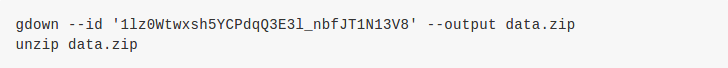

# Recurrent Neural Network
## Task Description: Text Sentiment Classification
* 本次task的data為twitter上收集到的推文，每則推文都會被標注為正面或負面，如:
   
 1：正面  
  
0：負面  
* dataset分為training和testing，其中training dataset又分為labeled training data和unlabeled training data
  * labeled training data    : 20萬 （句子配上0 or1，+++$+++ 只是分隔符號）
  * unlabeled training data  : 120萬 （只有句子，用來做semi-supervised learning)
  * testing data             : 20萬
* 希望利用training dataset訓練一個RNN model，來預測每個句子所帶有的情緒
## Download Dataset
  
## Implementation
### Word Embedding
Word embedding是一種將單字轉換為向量的方法，常見的word embedding方法有三類，大致上分為1-of-N Encoding，Bag-of-Words，和Prediction-Based Embedding:

### Preprocessing
### Model
### Ensemble
### Semi-Supervised Learning
### BOW + DNN v.s. RNN

---
### Reference:
投影片部份取自李宏毅教授的機器學習課程 (
[RNN](http://speech.ee.ntu.edu.tw/~tlkagk/courses/ML_2016/Lecture/RNN%20(v2).pdf)
[作業說明投影片](https://docs.google.com/presentation/d/1W5-D0hqchrkVgQxwNLBDlydamCHx5yetzmwbUiksBAA/edit#slide=id.g7cd4f194f5_2_151)
[kaggle連結](https://www.kaggle.com/c/ml2020spring-hw4) )
