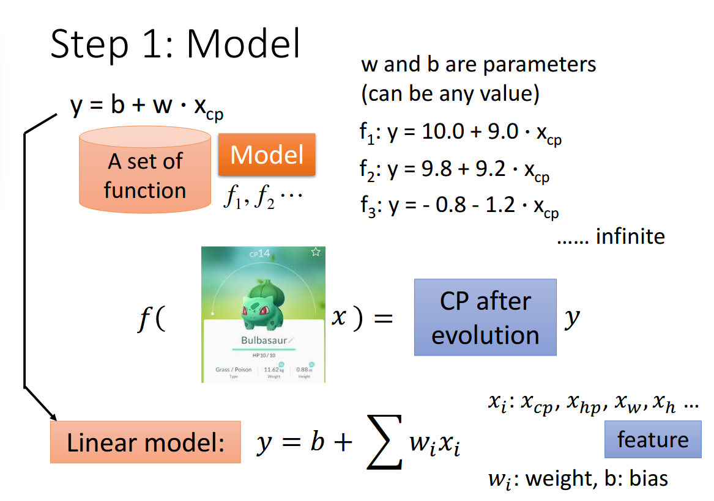
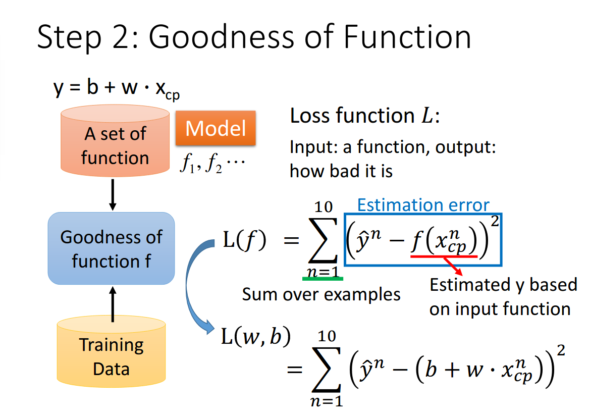
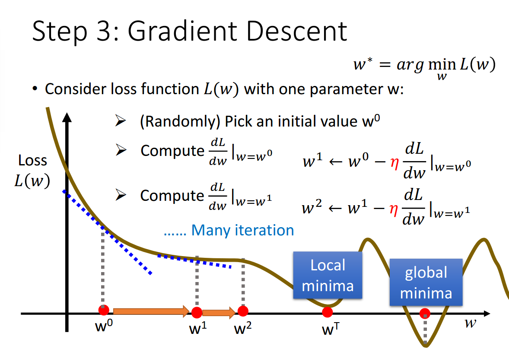
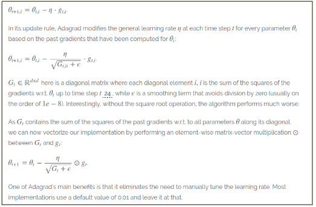

# Regression
## Task Description: PM2.5 Prediction
* 使用豐原站的觀測記錄分成, train set 跟 test set，train set 是豐原站每個月的前 20 天所有資料，test set 則是從豐原站剩下的資料中取樣出來
  * train.csv: 每個月前 20 天的完整資料
  * test.csv : 從剩下的資料當中取樣出連續的 10 小時為一筆，前九小時的所有觀測數據當作 feature，第十小時的 PM2.5 當作 answer，一共取出 240 筆不重複的 test data，請根據 feature 預測這 240 筆的 PM2.5
* Data 含有 18 項觀測數據 AMB_TEMP, CH4, CO, NHMC, NO, NO2, NOx, O3, PM10, PM2.5, RAINFALL, RH, SO2, THC, WD_HR, WIND_DIREC, WIND_SPEED, WS_HR
## Implementation
### 實作linear regression的步驟:
 
 
 

### Model Selection:  
在進行model的選擇時，我嘗試過以下三種model:   
  
經過測試後發現加入二次項的結果最佳，加入三次項會有overfit的情形，因此最終選擇加入二次項進行training

### Optimizer Selection:  
Adagrad:  

  
### Feature Selection:  
在進行feauture的選擇時，我考慮了資料的分佈性，對每項feature計算其標準差，如果標準差太小則代表此項feature的變化性很小，則對於預測PM2.5的幫助不大，因此將這些資料的值設為0，不予考慮，其餘則保留

Reference: 投影片部份取自李宏毅教授的機器學習課程 (
[課程投影片](http://speech.ee.ntu.edu.tw/~tlkagk/courses/ML_2017/Lecture/Regression.pdf)
[作業說明投影片](https://docs.google.com/presentation/d/18MG1wSTTx8AentGnMfIRUp8ipo8bLpgAj16bJoqW-b0/edit#slide=id.g4cd6560e29_0_15)
[kaggle連結](https://www.kaggle.com/c/ml2020spring-hw1) )
