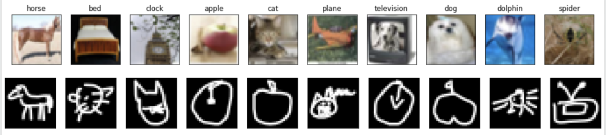
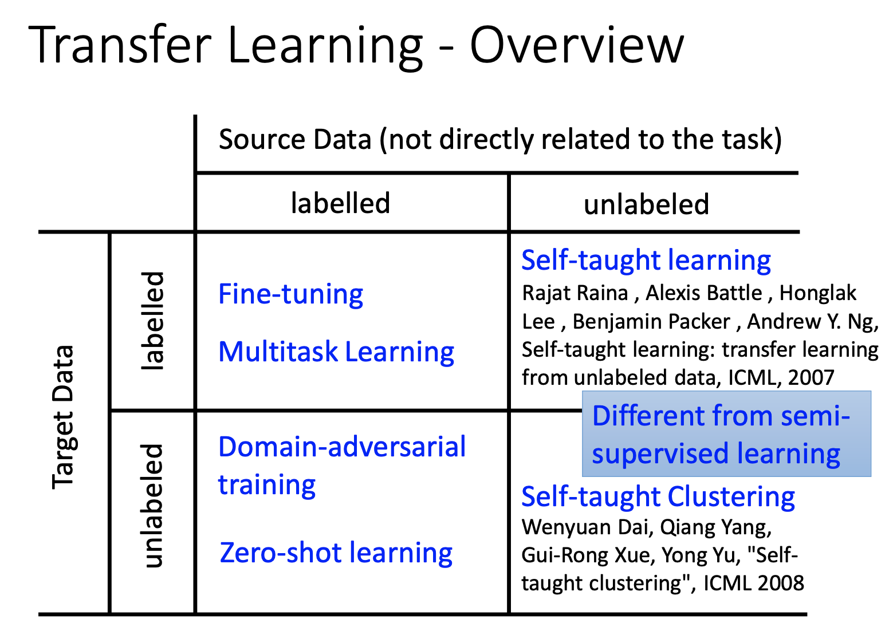
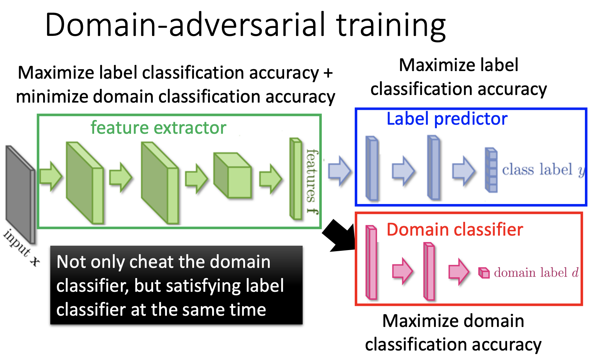
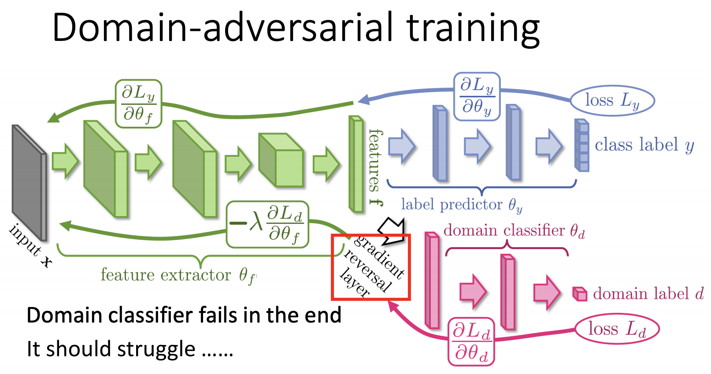
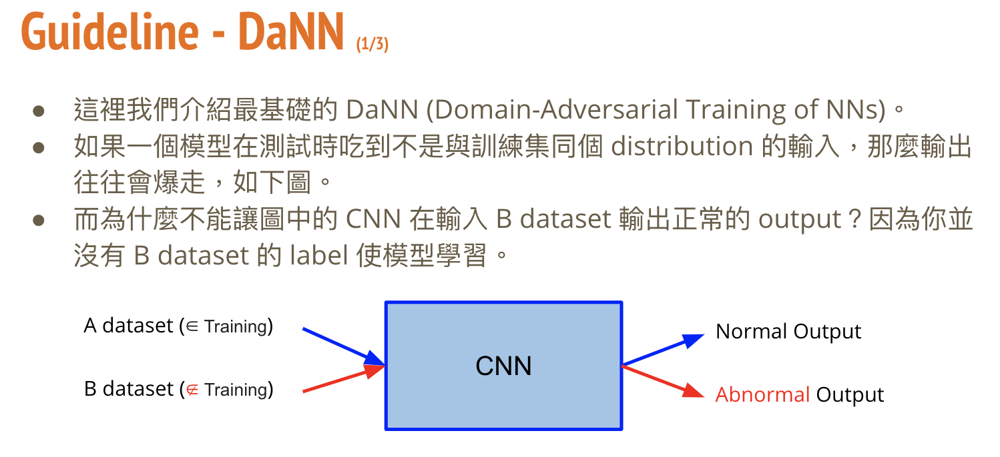
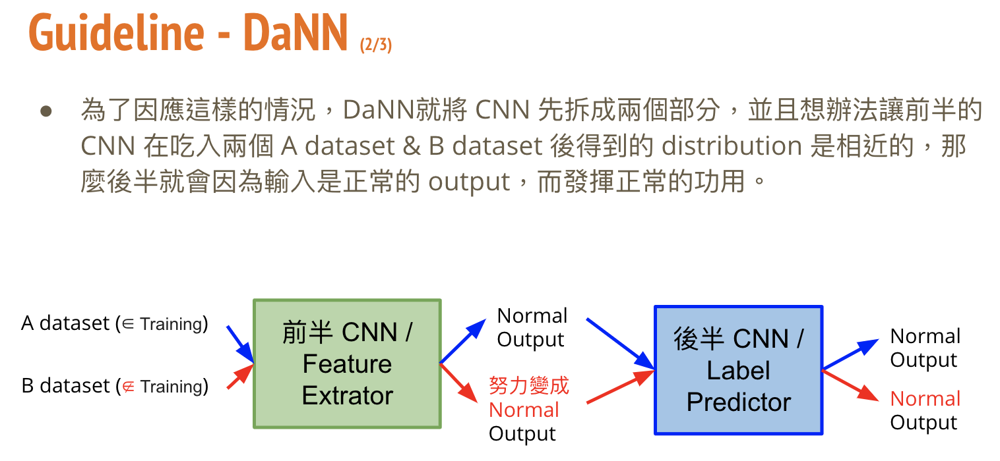
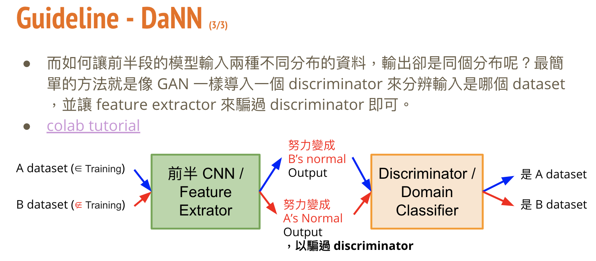

# Transfer Learning
## Task Description
* Domain Adaptation: 讓模型可以在訓練時只需要 A dataset label，不需要 B dataset label 的情況下提高 B dataset 的準確率（A dataset & task 接近 B dataset & task）
* 給定真實圖片 & 標籤以及大量的手繪圖片，請設計一種方法使得模型可以預測出手繪圖片的標籤為何
* Dataset:
  * Training : 5000 張真實圖片 + label, 32 x 32 RGB
  * Testing : 100000 張手繪圖片，28 x 28 Gray Scale
  * Label: 總共需要預測 10 個 class，如下圖所示  
  

## Download Dataset
[Download Link](https://drive.google.com/file/d/12-07DSquGdzN3JBHBChN4nMo3i8BqTiL/view)
## Implementation
  
 
 
  
  
 
 
  
  
  

---
### Reference:
投影片部份取自李宏毅教授的機器學習課程 (
[Transfer Learning](http://speech.ee.ntu.edu.tw/~tlkagk/courses/ML_2017/Lecture/transfer.pdf)
[作業說明投影片](https://docs.google.com/presentation/d/1EdSZBRQqJhvpS9-x1pASnO5P4-O-j-_OPIf7KytcGmg/edit#slide=id.g8179127ec4_9_0)
[Kaggle](http://www.kaggle.com/c/ml2020spring-hw12/))
