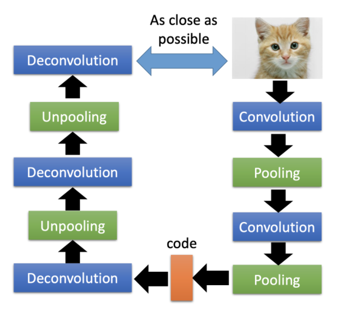
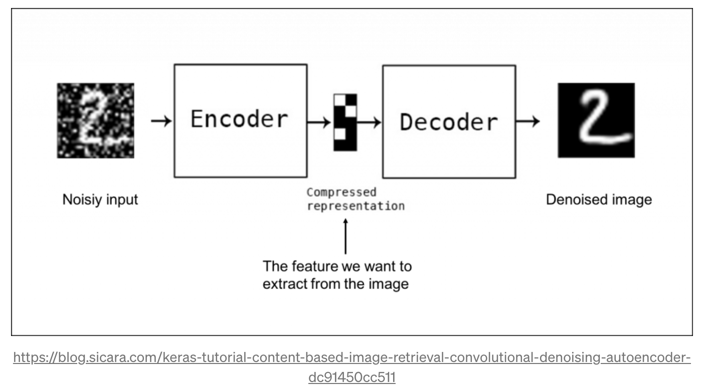
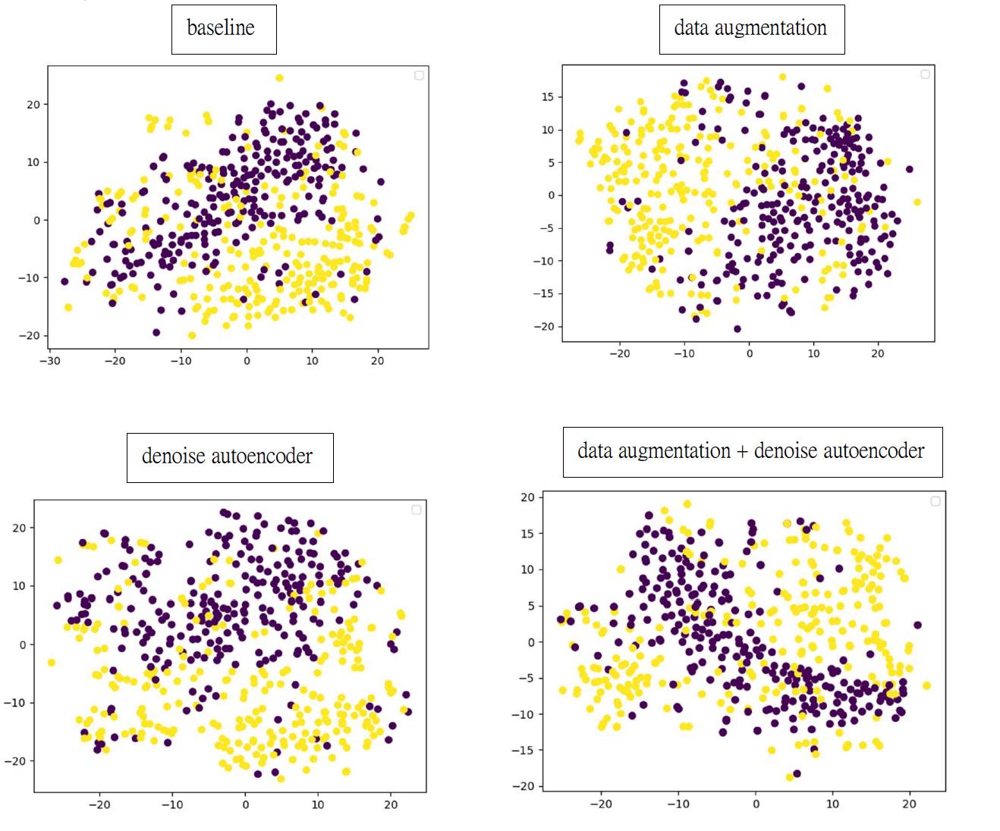
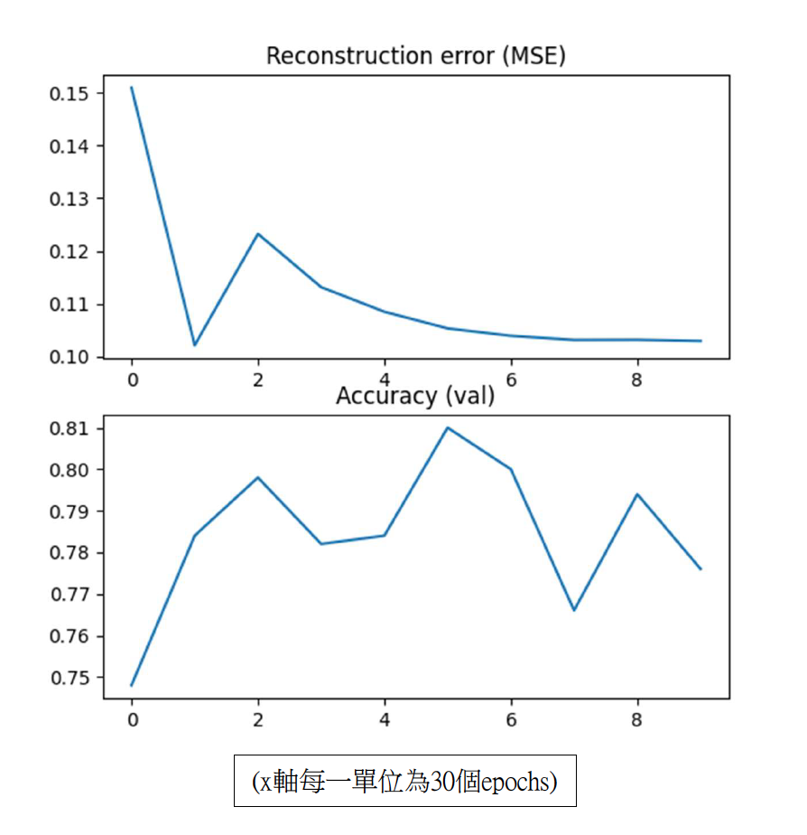

# Unsupervised Learning
## Task Description
* 分辨給定的兩張 images 是否為風景 (植物也算風景 e.g., 一片葉子)
* Dataset:
  * trainX.npy
    * 裡面總共有 8500 張 RGB 圖片，大小都是 32 * 32 * 3
    * shape 為 (8500, 32, 32, 3)
  * valX.npy
    * 裡面總共有 500 張 RGB 圖片，大小都是 32 * 32 * 3
    * shape 為 (500, 32, 32, 3)
  * valY.npy
    * 對應 valX.npy 的 label
    * shape為 (500,)

## Download Dataset
## Implementation
如果直接在原本的 image 上做 cluster，結果會很差（有很多冗餘資訊） 
→ 需要更好的方式來表示原本的 image  
 
為了找出這個更好的方式，可以先將原始 image 做 dimension reduction，用比較少的維度來描述一張 image  
e.g., autoencoder, PCA, SVD, t-SNE  
 
實作方法為用 autoencoder 將 8500 張圖片降維  
再利用降維過的 latent code 做分類  
預測 8500 筆測資是否來自相同的 dataset  
  
 
我實作的autoencoder架構為denoise autoencoder  
在圖片上加入一個範圍是 [0,1] 的random tensor，將加入noise後的圖片放進model中做預測，但是計算loss時要以原始image為target  
  
 
在preprocessing上，加入data augmentation:
* random horizontal flip
* random rotation
* random color jitter
 
得到的結果為：  
  
  

---
### Reference:
投影片部份取自李宏毅教授的機器學習課程 (
[Unsupervised Learning](http://speech.ee.ntu.edu.tw/~tlkagk/courses/ML_2017/Lecture/PCA%20(v3).pdf)
[作業說明投影片](https://docs.google.com/presentation/d/1ULbTKqn7ikFOTU-r0DoqAca6lej3QmLWwORfcr-0F3o/edit#slide=id.g7be340f71d_0_0) )
